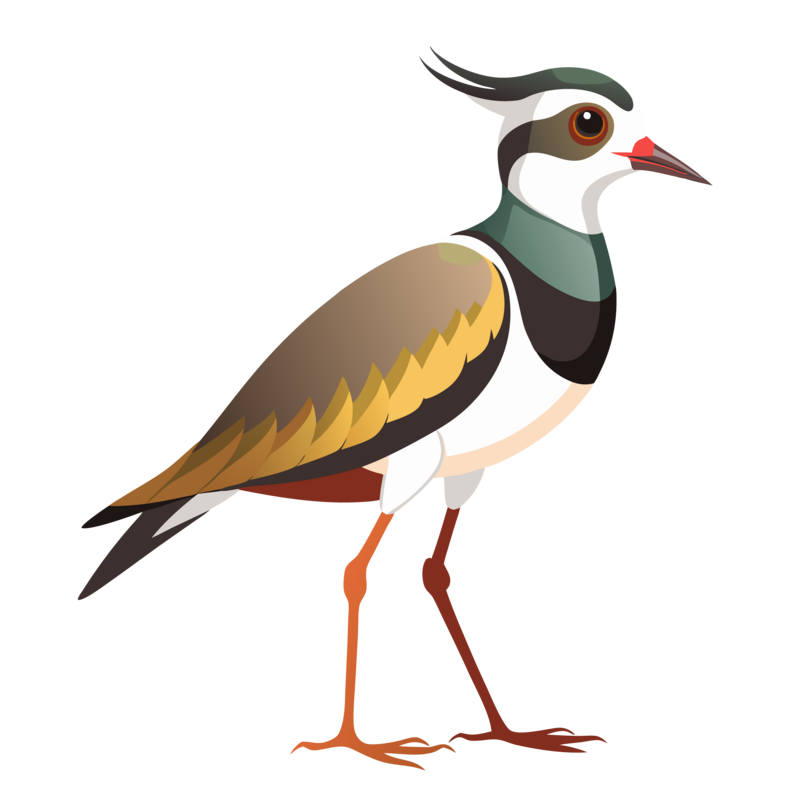

<p align="center">
  
</p>

# Lapwing

Sentinel-2 satellite imagery downloader and analyst for agricultural field boundaries. Give it a shapefile, get back clipped GeoTIFFs — RGB true-colour, NDVI, NDWI, False Color, and elevation (DEM).

A companion to [Perch](https://github.com/Dozer3530/Perch) — Perch lands your drone imagery, Lapwing watches from above.

---

## Features

- Downloads all Sentinel-2 L2A scenes for a field boundary (all time, cloud-filtered)
- Clips each image exactly to your field boundary
- Produces GeoTIFFs ready to open in QGIS
- Output types:
  - **RGB** — true-colour (TCI)
  - **NDVI** — vegetation health index (colourized + raw float32)
  - **NDWI** — water index
  - **False Color** — NIR composite (healthy vegetation = bright red)
  - **DEM** — elevation + slope maps (cascades: NRCan 1m → OpenTopography LiDAR → Copernicus GLO-30)
- Historical NDVI average — composites all years within a seasonal window
- GUI (`gui.py`) and CLI (`finder.py`) interfaces
- Parallel downloads; optional S3 direct access for speed

## Supported input formats

- Zipped shapefile (`.zip`)
- Loose shapefile (`.shp` + siblings)
- GeoPackage (`.gpkg`)

## Requirements

- Python 3.10+
- Free [Copernicus Data Space](https://dataspace.copernicus.eu) account
- (Optional) [OpenTopography](https://opentopography.org/myopentopo) API key for higher-res DEMs

## Installation

```bash
pip install -r requirements.txt
```

## Configuration

Copy `.env.example` to `.env` and fill in your credentials:

```
CDSE_USERNAME=your@email.com
CDSE_PASSWORD=yourpassword

# Optional — faster S3 downloads
CDSE_S3_KEY=
CDSE_S3_SECRET=

# Optional — higher resolution DEMs
OPENTOPO_KEY=
```

S3 credentials are generated at `dataspace.copernicus.eu → Account → S3 credentials`.

## Usage

### GUI

```bash
python gui.py
```

### CLI

```bash
python finder.py field.zip
python finder.py field.zip --cloud-cover 5 --output my_images --workers 4
```

All outputs are GeoTIFF (`.tif`) — open directly in QGIS.
